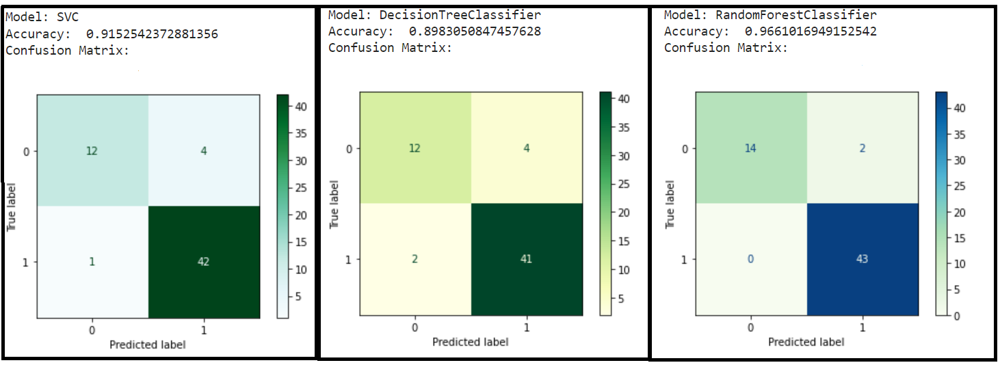

# Parkinson-Disease-Detection-using-ML

                                                            
## What is Parkinson's Disease:
Parkinson's disease is a type of disorder of our central nervous system. This disorder affects the movement of a person. 
Damage of nerve cells in the brain lead to this disease. Other symptoms are posture imbalance, slow movement and tremor- rhythmic shaking of body parts. 

This diesase can last for years, or life long as well. Treatment can help, but cannot cure this disorder. People usually develop this disease around 60 years age or older. 

## What is the Dataset about:
The dataset is composed of a range of biomedical voice measurements from 31 people, 23 of them have Parkinson's disease. Each column of the table is a voice measure and there are a total of 195 measurements gathered in the dataset.

Attributes Explanation: 

name - Subject name and Recording  
MDVP:Fo(Hz) - Average vocal fundamental frequency 
MDVP:Fhi(Hz) - Maximum vocal fundamental frequency 
MDVP:Flo(Hz) - Minimum vocal fundamental frequency 
MDVP:Jitter(%),MDVP:Jitter(Abs),MDVP:RAP,MDVP:PPQ,Jitter:DDP - Several measures of variation in fundamental frequency 
MDVP:Shimmer,MDVP:Shimmer(dB),Shimmer:APQ3,Shimmer:APQ5,MDVP:APQ,Shimmer:DDA - Several measures of variation in amplitude 
NHR,HNR - Two measures of ratio of noise to tonal components in the voice 
status - Health status of the subject (one) - Parkinson's, (zero) - healthy 
RPDE,D2 - Two nonlinear dynamical complexity measures 
DFA - Signal fractal scaling exponent 
spread1,spread2,PPE - Three nonlinear measures of fundamental frequency variation 

Link to dataset: http://archive.ics.uci.edu/ml/datasets/Parkinsons/about.html

## Main aim / Problem Statement
The aim of the data is to classify healthy people and people having parkinson's disease, according to the 'status' column which indicates 0 for healthy person and 1 for person having parkinson.

## Approach used:

Type of Machine Learning problem: Classification
As we have to predict a discrete output that is 0 (healthy patient) or 1 (patient having parkinson), these represent the 2 classes of our data. And thus, this is a Binary Classification Problem. 
We will use following methodology for predicting the outcome:
1) Importing Data
2) Getting Overview of the Data
3) Performing Exploratory Data Analysis, trying to find patterns in data
4) Selecting the highly correlated features for Model Building
5) Data Pre-processing including Missing/Null value treatment, Scaling if required
6) Creation of Training and Test sets
7) Choosing 2-3 best algorithms suitable for the data and type of problem we are aiming to solve
8) Model building using the chosen algorithms
9) Training the models using training dataset
10) Testing the models (As it is a classification problem, we will use Accuracy and Confusion Matrix as our evaluation metrics)
11) Choosing the Best Model and Saving for future use

## Algorithms used:

As we have small amount of data, and we need good accuracy of the model using this data, we will train our model using following Supervised Learning Algorithms and then compare the scores:

1) Support Vector Classifier:  
Support Vector Machine (SVM) Classifier is one of the Supervised Learning Algorithm. It's goal is to find best decision boundary / hyperplane which will separate the provided classes. For finding the right hyperplane, SVM chooses an extreme point per class, which is called as a support vector.  

           

2) Decision Tree Classifier:  
Decision Tree is a tree structured classifier, where internal nodes (called as decision nodes) of tree represent features from the dataset, and leaf nodes represent the classes / outcome. Decision nodes are used for making a decision and can have multiple branches, Leaf nodes are the output of these decisions, they have no branches. Decision nodes ask a Yes/No question and depending on the answer they are split into branches / sub-trees.
 &emsp;

 
3) Random Forest Classifier:  
Random Forest Classifier is based on Ensemble Learning concept, which combines multiple classifiers and solves a complex problem, increases performance. Random Forest contains a number of decision trees and depends on the results / predictions of these individual trees. Based on majority votes of prediction, it predicts the final output.  

          

## Results:
<table cell-spacing="5" cell-padding="10" border="3">
  <tr>
    <th>Algorithm used for Model</th>
    <th>Accuracy</th>
  </tr>
  <tr>
    <td>Support Vector Classifier</td>
    <td>0.9152542372881356</td>
  </tr>
  <tr>
    <td>Decision Tree Classifier</td>
    <td>0.8983050847457628</td>
  </tr>
  <tr>
    <td>Random Forest Classifier</td>
    <td>0.9661016949152542</td>
  </tr>
  </table> 

## Conclusion:

We have accomplished our Main Aim of classifying healthy people and people having parkinson's diease based on the 'status' column of dataset. 
Firstly we imported the data, performed some Exploratory Data Analysis to gather insights about data. 
Then, we did Data Pre-processing that included, Feature Selection based on Pearson correlation, we separated the highly correlated features. 
We performed Standard Scaling on the chosen features, created training and test sets, later used them for Model Building. 
We chose 3 algorithms for our model building depending on our data: 

1) Support Vector Machine 
2) Decision Tree 
3) Random Forest 

Next, we trained separate models using these algorithms and compared the evaluation results. We observed that Random Forest algorithm outperformed out of the chosen algorithms. 
Lastly, we saved our final model trained using Random Forest algorithm to the disk.
